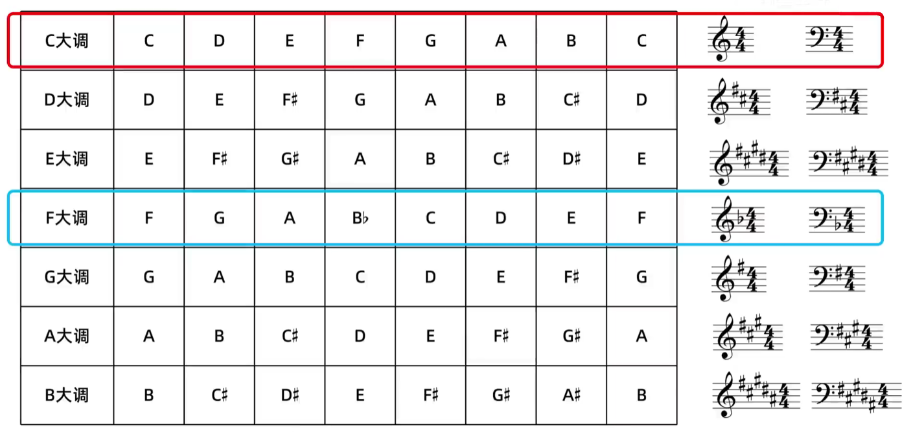
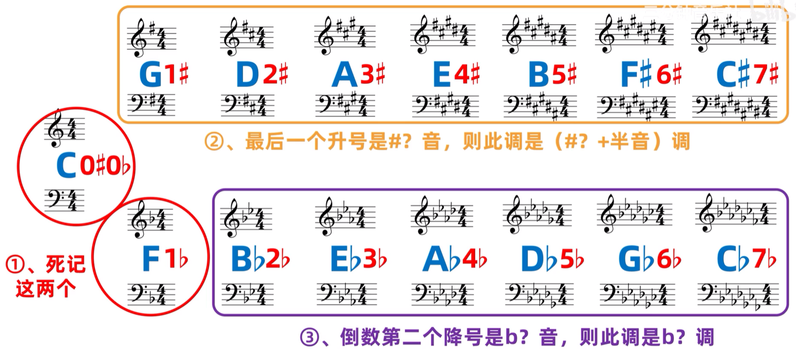
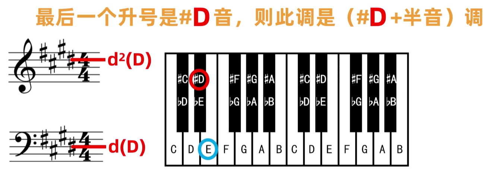
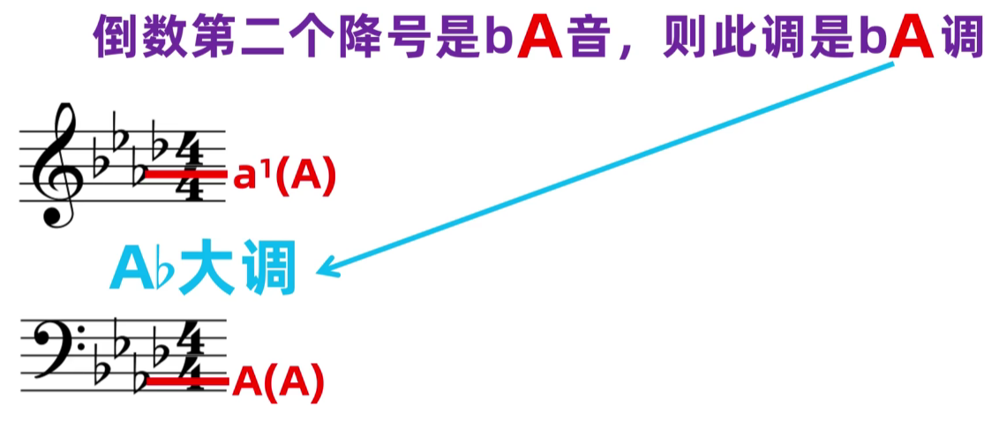
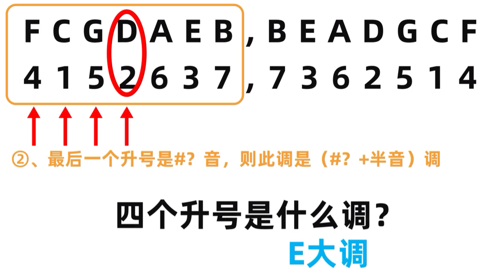
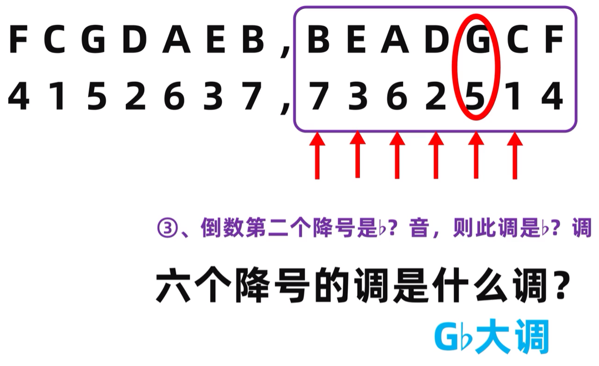

# 调号

调式中有几个升降符号，五线谱上就有几个升降符号，并且每个升降符号位置对应各自的音符位置

除 C 和 F 大调，其他调号都可以通过以下规则快速判断

最后一个升号是 `♯?`，则此调是 `♯?+0.5` 大调

倒数第二个降号是 `♭?`，则此调是 `♭?` 大调

{ width="90%" }

在没有谱子的情况下，还可以通过升降号的数量快速判断调式，或者通过调式反推升降号数量

下表中左边对应 `♯`，右边对应 `♭`，推断时候都是从左往右读，最后一个音符必定是表中的对应位置的升音音符或者降音音符，然后根据上文的调号规则推断

