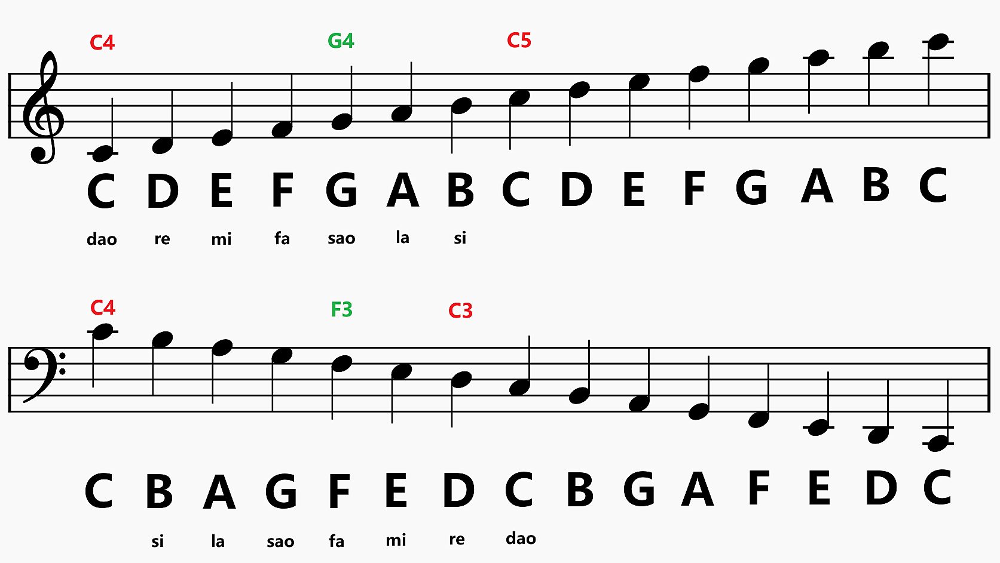
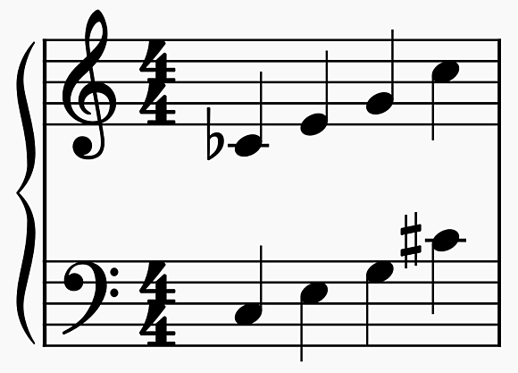

# 谱号

五线谱的图示称为五线四间，每个位置都能放置一个音符

高音谱号起点二线开始，对应 g^1^ (G4)，下加一线为 c^1^ (C4)

低音谱号起点四线开始，对应 f (F3)，上加一线为 c^1^ (C4)

!!! note
    高音下加一线 = 低音上加一线 = C4，高音上加二线 = C6，低音下加二线 = C2

!!! note
    五线谱线和间上的音符都是指白键，黑键直接用音符加升降符号表示