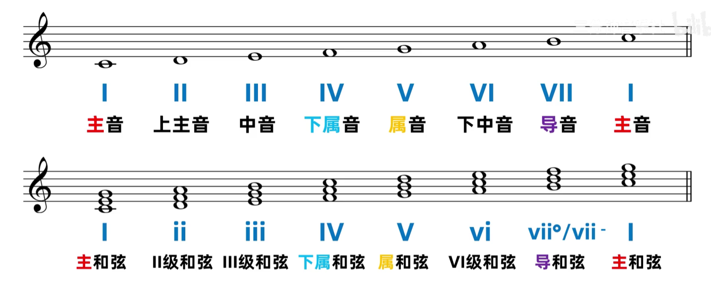
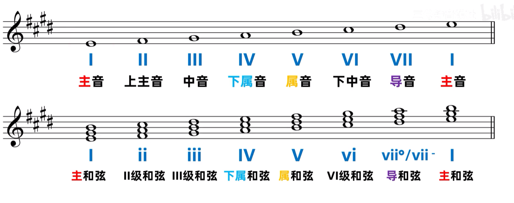
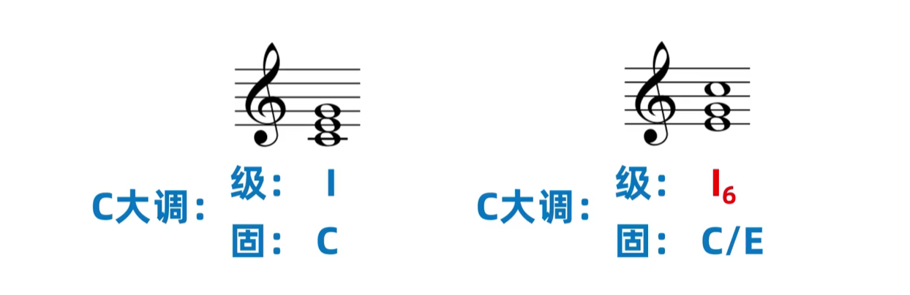
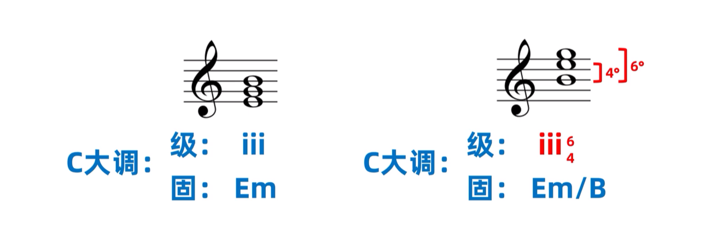
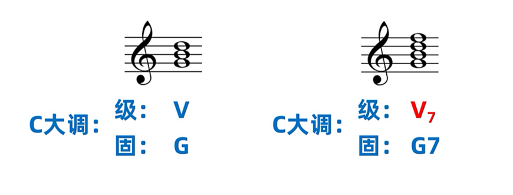
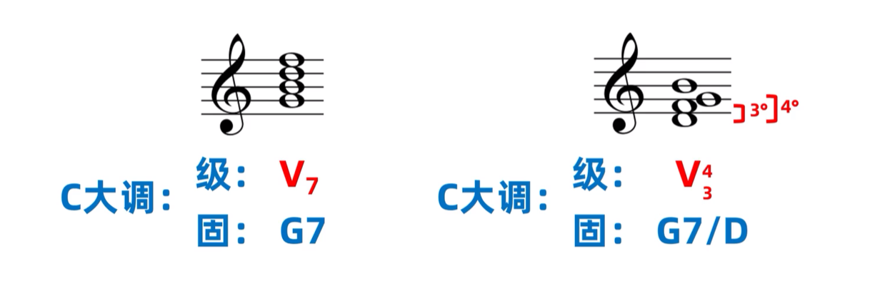
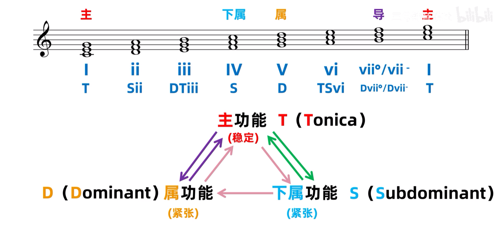

## 级数标记法

级数标记法类似于简谱的首调标记法，音符和构成和弦的音都是调内的音，并且和弦可以根据和弦的大小类型来对照的将级数写为对应的大小写

在下图的 C 大调中，`c` 就是一级音，`ceg` 就是一级和弦，因为一级和弦是大三和弦，所以写为大写 I

在下图的 E 大调中，`e` 就是一级音，`egb` 就是一级和弦

### 和弦转位标记

“级”表示级数标记法，“固”表示固定标记法

图中的 I~6~ 表示一级和弦的第一转位六和弦，具体可以查看[六和弦](和弦固定标记法/#六和弦)

iii~4~^6^ 表示三级和弦的第二转位四六和弦，具体可以查看[四六和弦](和弦固定标记法/#三和弦转位)

V~7~ 表示五级和弦的七和弦，具体可以查看[七和弦](和弦固定标记法/#七和弦)

V~3~^4^ 表示五级和弦的七和弦第二转位三四和弦，具体可以查看[三四和弦](和弦固定标记法/#七和弦转位)

## 功能级数标记法

属于同一功能组的和弦可以互相替换，比如主功能组的 I 和弦可以替换为 I~6~ 和弦或者 Imaj7 和弦或者 Iadd9 和弦