## 三和弦

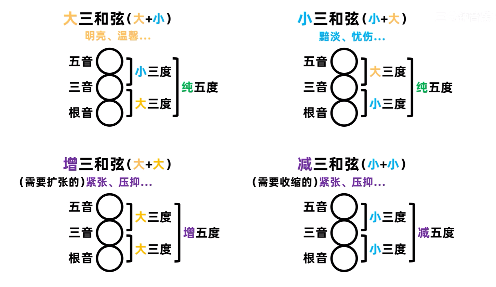

### 三和弦转位

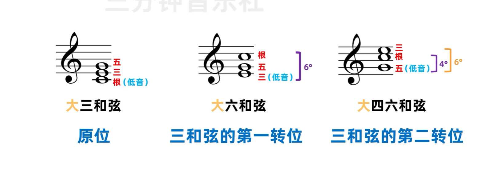

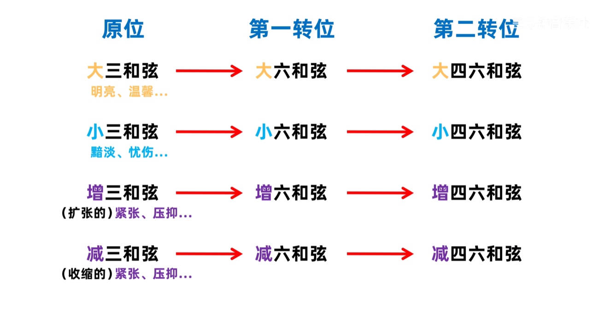

## 七和弦

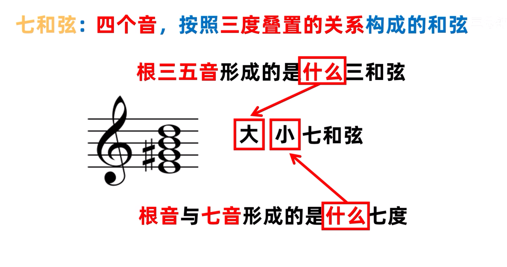

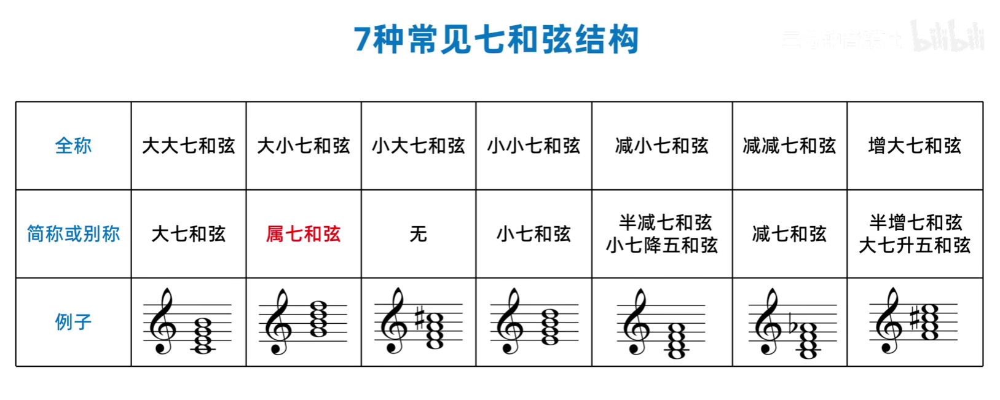

### 七和弦转位

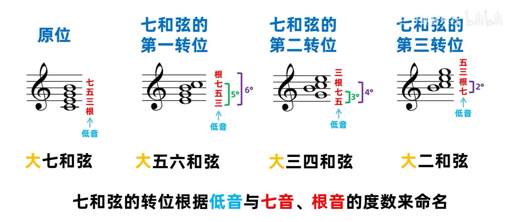

## 转位和弦

转位和弦标记法有多重叫法，斜杠和弦、分数和弦、分割和弦、slash 和弦

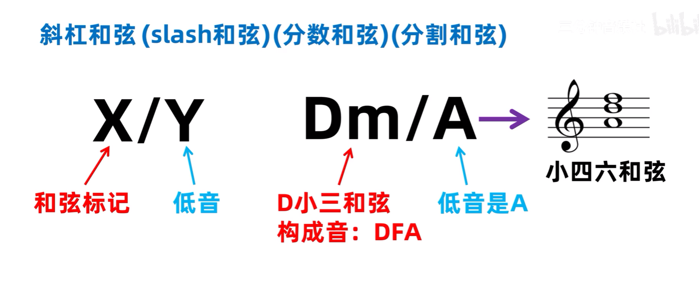

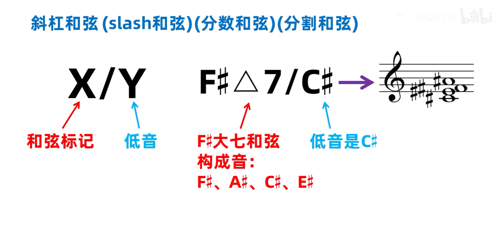

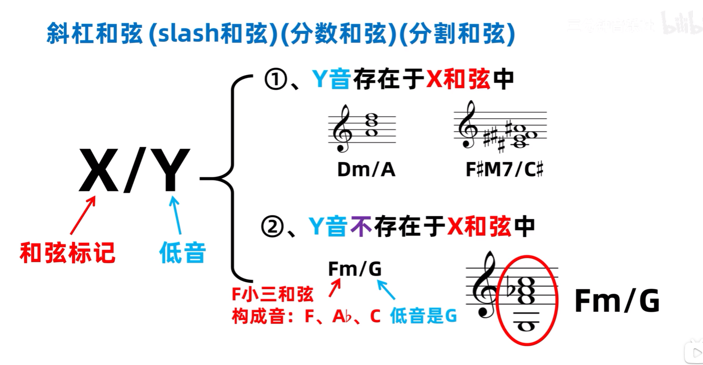

## 固定标记法

音程与三和弦

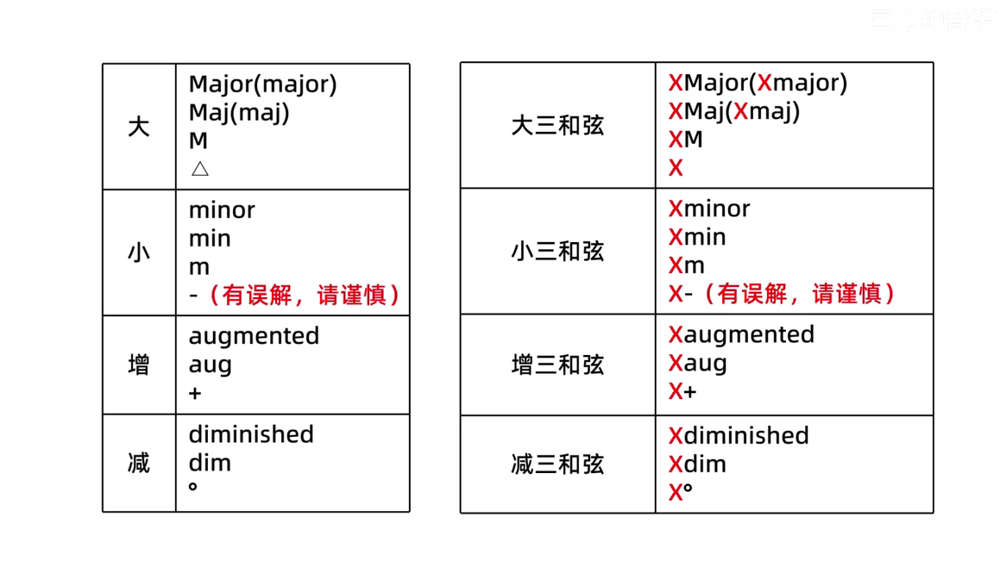

七和弦

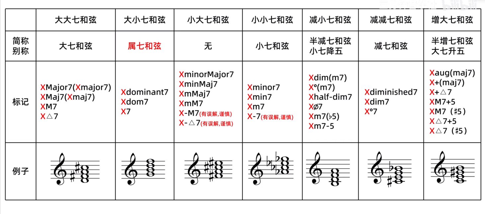

!!! note
    减小七和弦又称 "小七降五和弦"，因为只要将小七和弦的五音减半音就是减小七和弦，所以又叫做 "半减七和弦" ， "大七升五和弦" 同理

## 九/十一/十三和弦

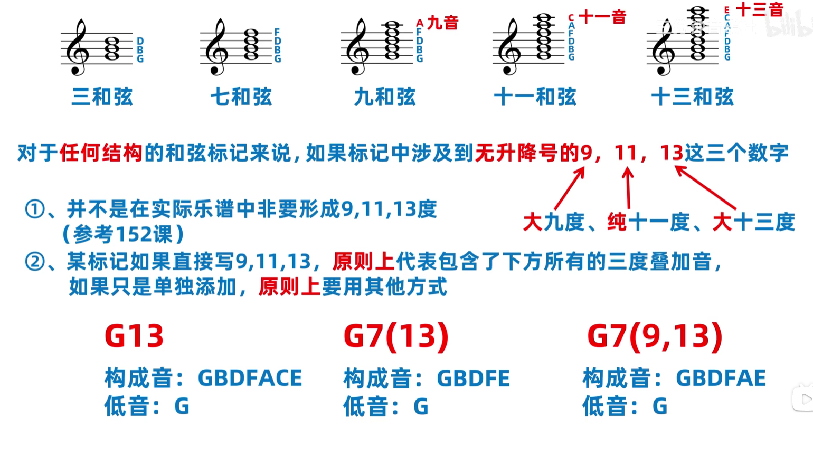

## 加音和弦

在和弦中加入一个新的构成音，就是加音和弦

例如 Cadd9 就是加一个和低音 C 相差{==大九度==}的 D 音，但因为转位原理，实际的乐谱中并不一定是和低音相差大九度，因此 Cadd9 和 Cadd2 并没有什么差别

Cadd11 和 Cadd13 也是同理

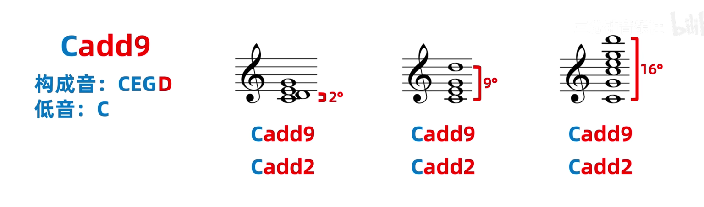

大多数场景中都使用 add4/add6/add9 来表示，但 add4 会模糊三音，所以实际上 add4 很少使用

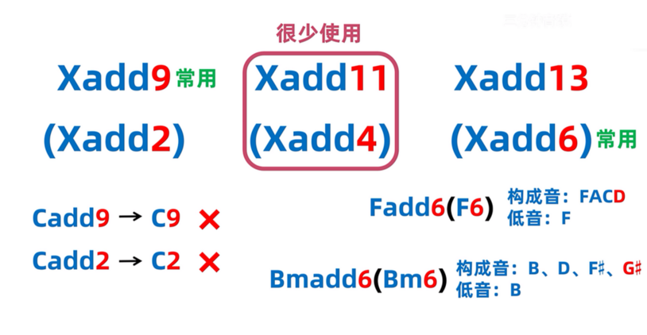

!!! note
    add6 还可以进一步简写，例如 Cadd6 可以简写为 C6，这时候就被称为六和弦，但六和弦有两种含义，详见[六和弦](#六和弦)

## 挂留和弦

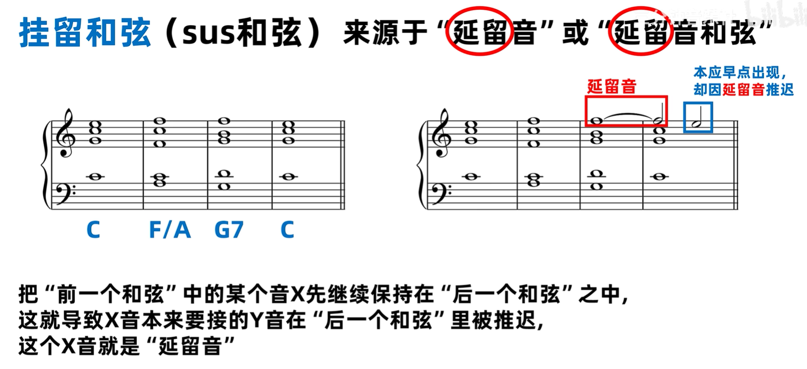

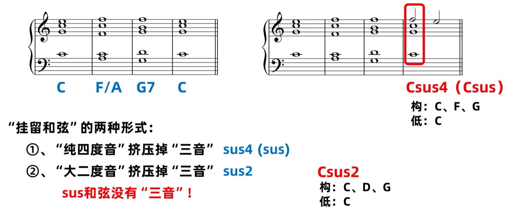

## 六和弦

六和弦有两种含义

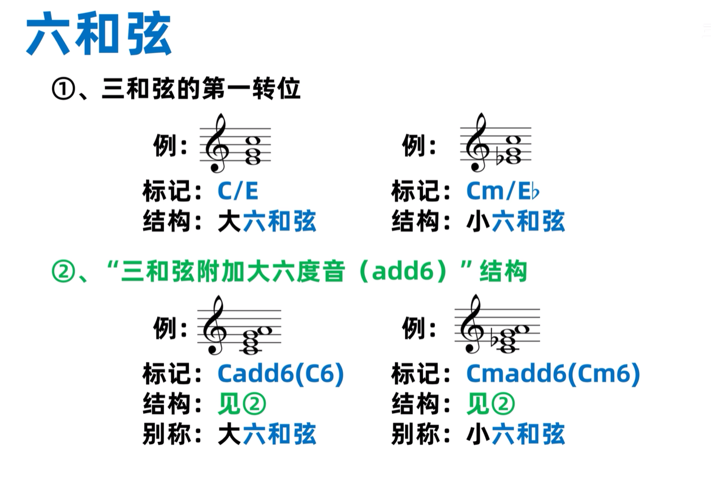

## 六九和弦

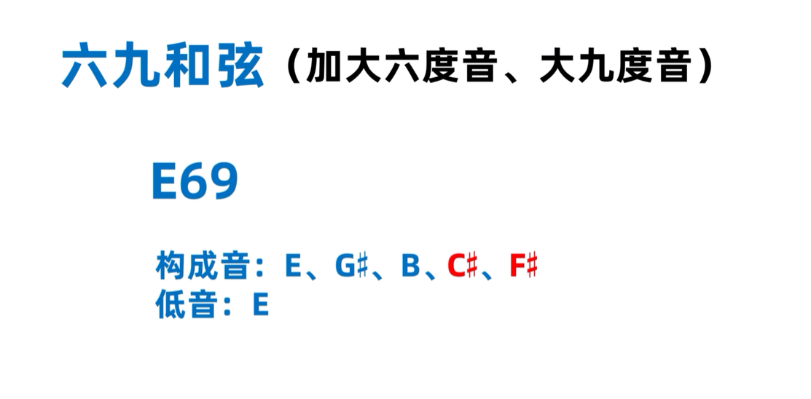