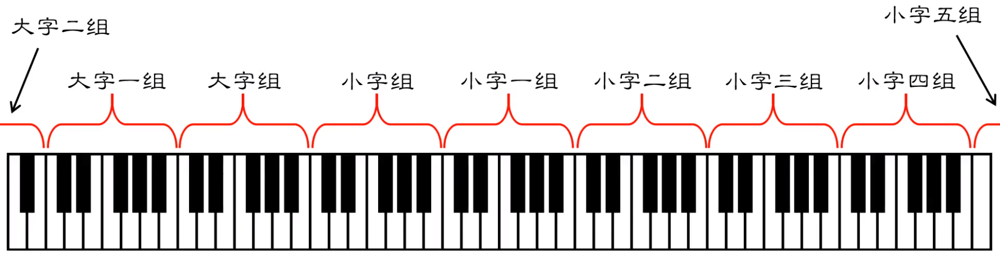
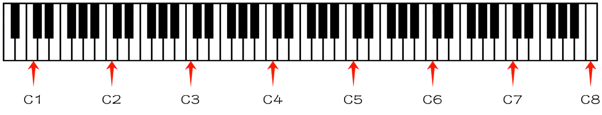

# 音调记号法

因为 1 = C 这类标记常用于简谱，所以大部分简谱中的 C 都表示的是 中央C

中央C 根据不同的音名分组法，可分别表示为赫尔姆霍茨音调记号法(C = c^1^)和科学音调记号法(C = C4)

## 赫尔姆霍茨音调记号法

大字组音名大写，组号在右下角；小字组音名小写，组号在右上角

大字一组: C~1~，小子一组: c^1^

这里的 中央C 即是 c^1^

## 科学音调记号法

这里的 中央C 即是 C4

!!! note
    除了 中央C(C4)，还有 标准音(A4)，频率为 440Hz