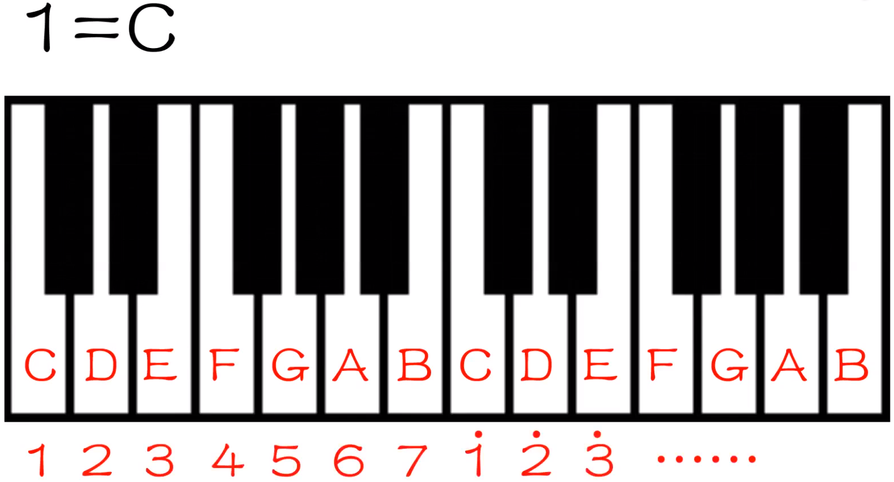
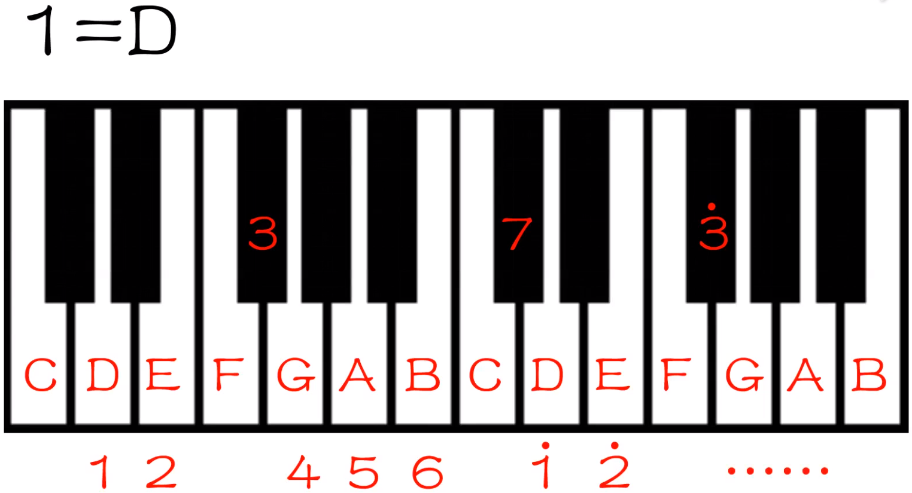
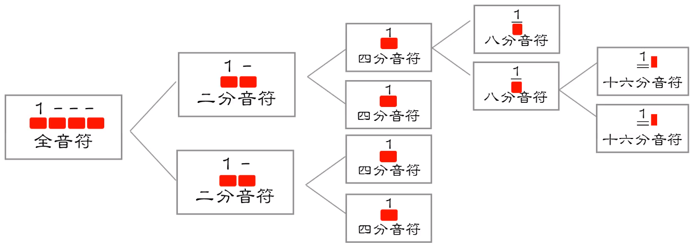
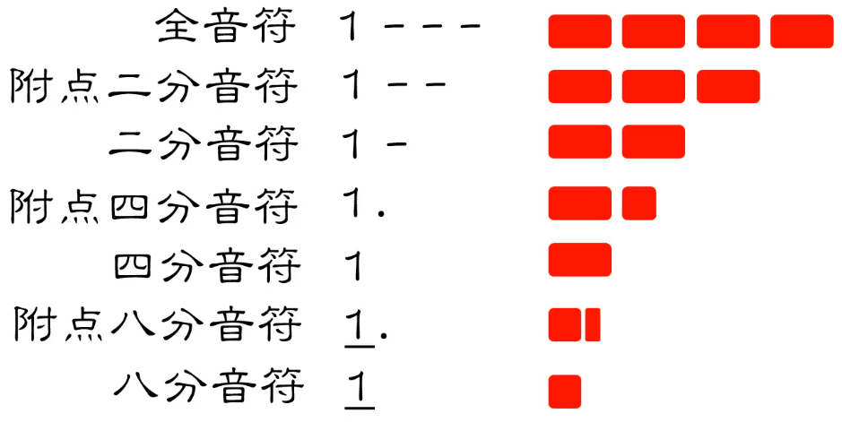
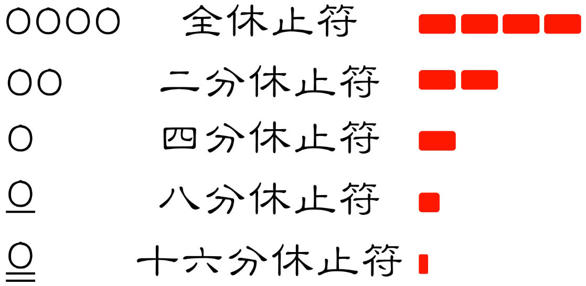

# 符号

1 = ？，就表示主音 1 从 ？键出发，按序排列音阶

{ width="50%" }

{ width="50%" }

## 高低音

每一个点即表示一个八度

{ width="50%" }

{ width="50%" }

## 音符

根据音符的时长可分为以下几种，以下并不为全部音符，红色方块仅指代一拍的长度，并没有具体时长

{ width="80%" }

### 附点音符

延长前面音符本身时长的一半

{ width="50%" }

### 休止符

用数字 0 代表休止符

{ width="40%" }