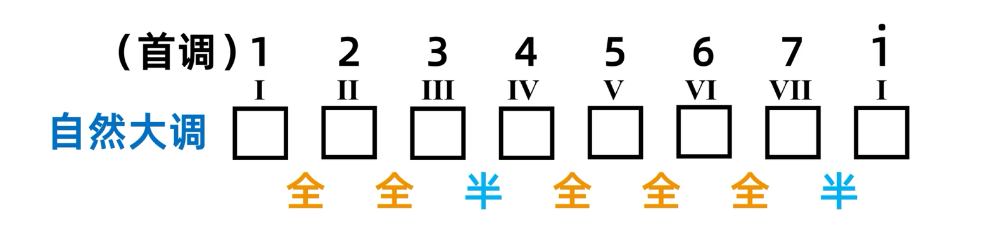
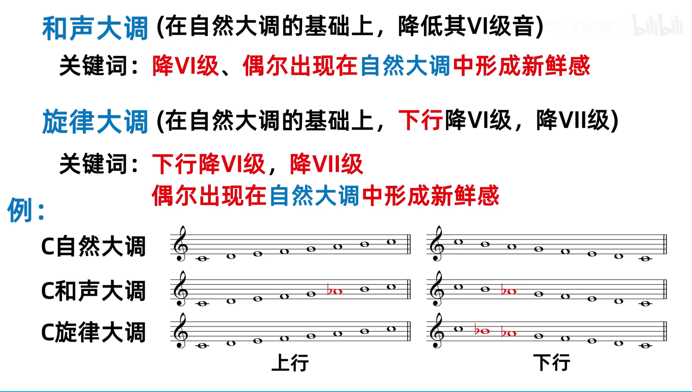

## 自然大调

当音阶遵循 全全半全全全半 的规则，就称之为自然大调，简称为大调

{ width="70%" }

当调号为 1 = C 时，这个大调就称为 C大调

调式必须保证每一个音名都出现一次，根据不同的情况需求，每个键即可以是升音，又可以是降音

C 大调: C D E F G A B C

♯C 大调: ♯C ♯D ♯E ♯F ♯G ♯A ♯B ♯C

D 大调: D E ♯F G A B ♯C

♭D 大调: ♭D ♭E F ♭G ♭A ♭B C ♭D

### 等音调

声音相同但音名不同的大调，称为等音调

例如 ♯C 大调 和 ♭D 大调，二者弹奏出来的完全相同，但是表示方法却不相同

## 和声大调

## 旋律大调

{ width="70%" }