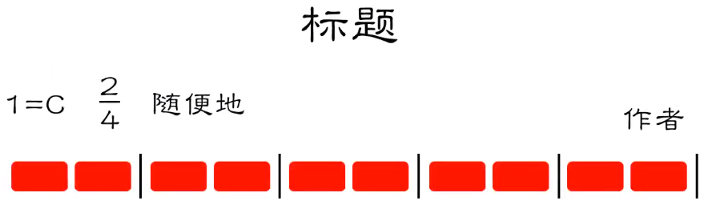
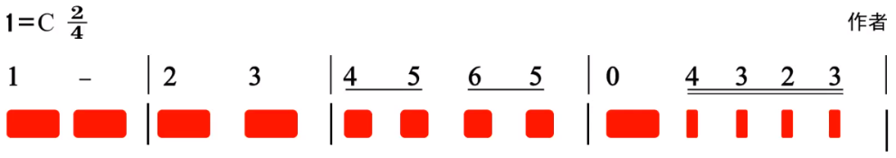
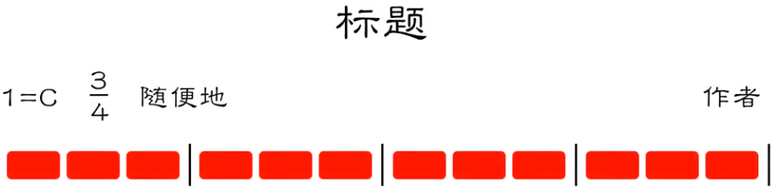
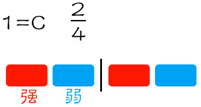
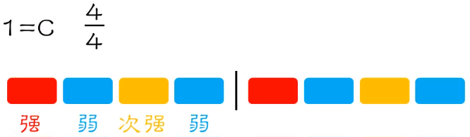
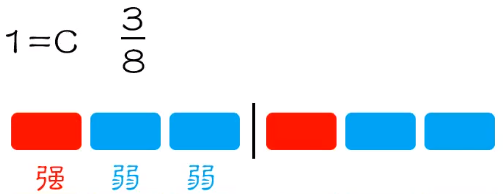
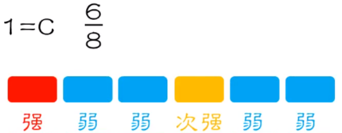
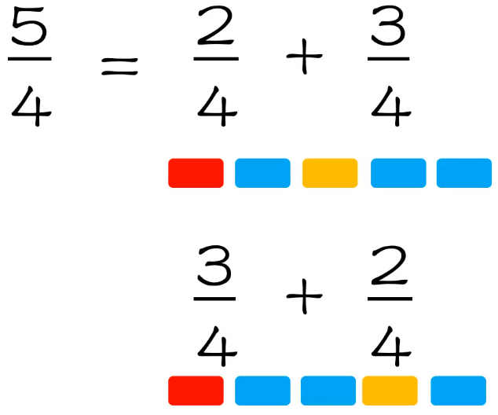
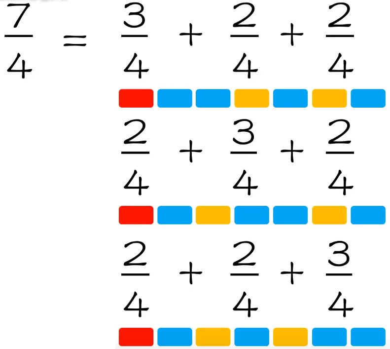

# 节拍

## 节拍号

2/4 表示以四分音符为一拍，每小节有 2 拍，中间用小节符分隔

{ width="50%" }

{ width="50%" }

同理 3/4 拍

{ width="50%" }

需要注意的是，每小节有多少拍是没有具体规定的

## 强弱关系

每个小节只能有一个强拍，其余强拍都要转换为次强拍

{ width="25%" }

{ width="50%" }

{ width="40%" }

{ width="40%" }

## 拍子

### 单拍子

每个小节都有强有弱，但强拍只有一个

### 复拍子

由两个或两个以上相同的单拍子组合而成

### 混合拍子

由两个或两个以上不相同的单拍子组合而成

混合拍子的单拍子排列组合通常不止一种，具体使用哪种需要根据实际情况判断

{ width="35%" }

{ width="40%" }