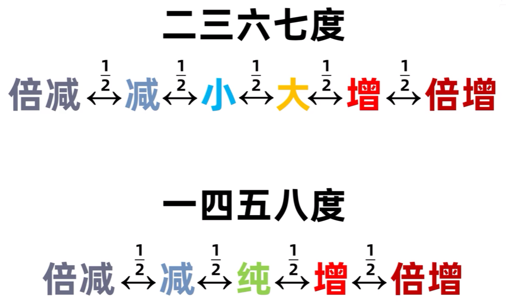
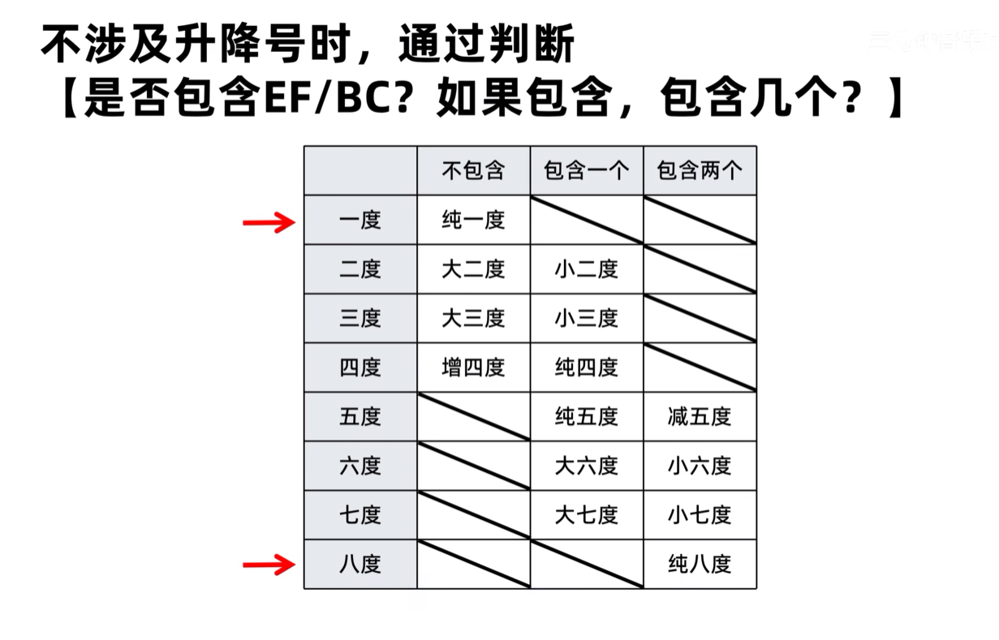
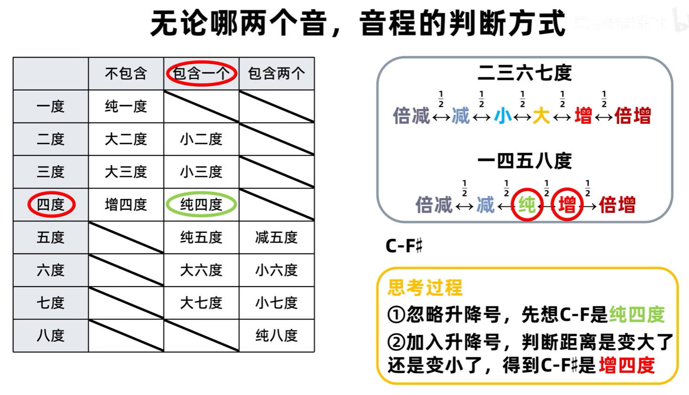
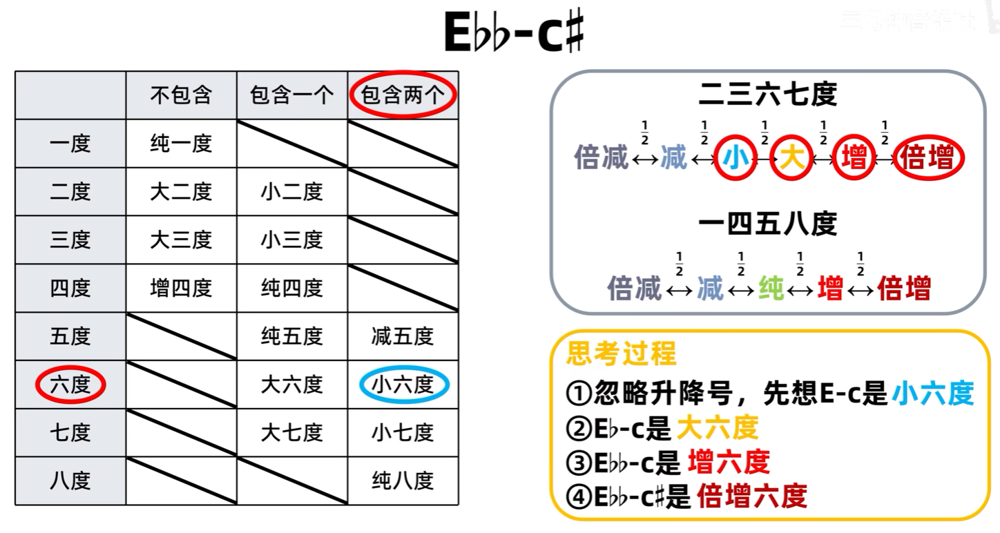
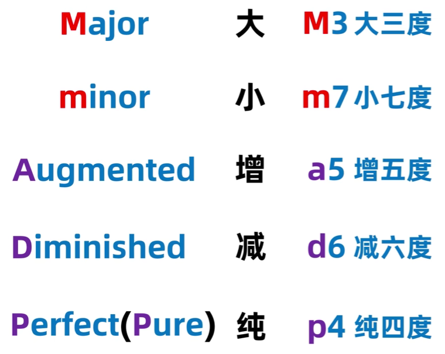
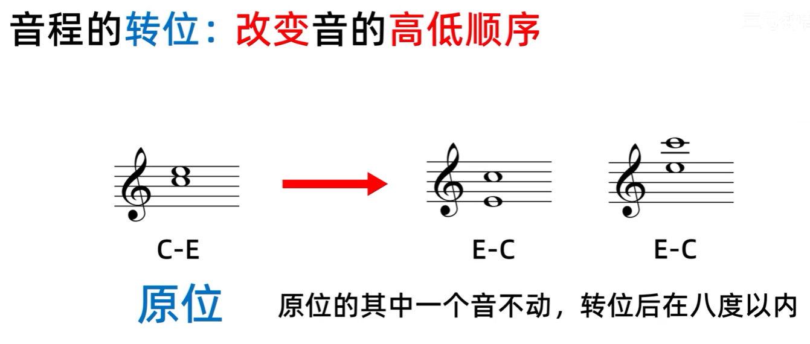
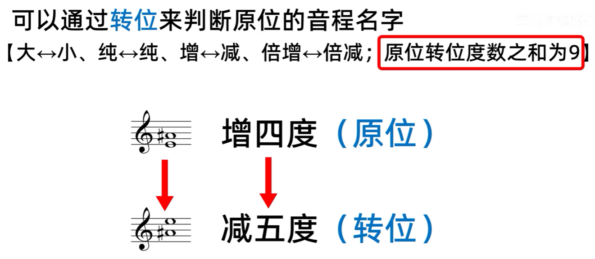
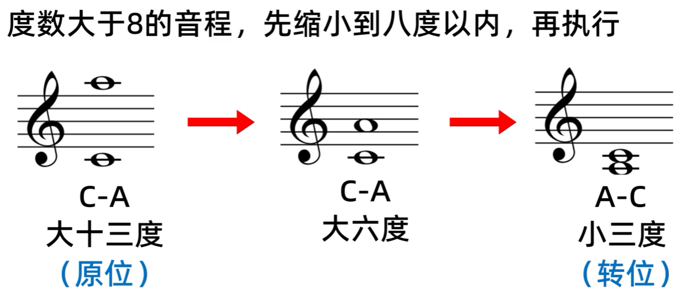

# 音程

## 音值

无论白键与黑键，相邻的两个键之间的距离就是一个半音

## 音程

两个音之间的距离称为音程，音程上有几个音就是几度，比如 CE 有 C、D、E 三个音，所以是三度

!!! note
    BC，EF 这两组音无论何时都是相邻的，音程的音值只有半音

音程根据每组音的音值数区分其对应的名称

音程的快速判断方法

方法一:

根音的八度减半音是大七度, 减全音是小七度

根音的大七度减全音是大六度, 小七度减全音是小六度

方法二: 

!!! tip "八度外音程快速判断"
    对于音程超过八度的音，可以先降低到八度以内(度数 -7)，确定音程之后，再还原八度，这个方法也可以倒过来使用

## 缩写

## 转位

转位音程和原位音程的快速判断公式

